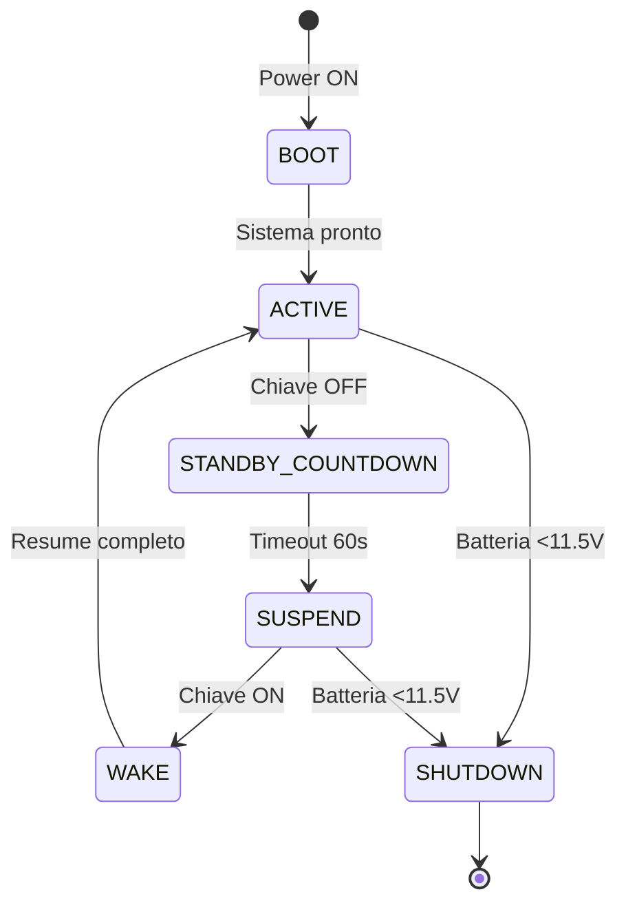

# ⚡ HyperMusa - Power Management System

Documentazione tecnica completa del sistema di gestione alimentazione e standby mode.

---

## 📋 Indice

1. [Panoramica Sistema](#1-panoramica-sistema)
2. [Analisi Consumi](#2-analisi-consumi)
3. [Standby Mode Architecture](#3-standby-mode-architecture)
4. [Hardware Setup](#4-hardware-setup)
5. [Software Implementation](#5-software-implementation)
6. [Testing & Validation](#6-testing--validation)
7. [Troubleshooting](#7-troubleshooting)

---

## 1. Panoramica Sistema

### Obiettivi Design

- ⚡ **Boot rapido**: <5s da standby (vs 35-40s cold boot)
- 🔋 **Autonomia estesa**: 7+ giorni auto parcheggiata
- 🛡️ **Protezione batteria**: Auto-shutdown se voltaggio <11.5V
- 🔄 **Trasparente**: User experience seamless (come Cyberpandino)

### Stati Sistema

```
┌─────────────────────────────────────────────────┐
│      STATI POWER MANAGEMENT HYPERMUSA           │
│                                                  │
│  1. BOOT (Cold Start)                           │
│     - Primo avvio dopo spegnimento completo     │
│     - Durata: 35-40s                            │
│     - Consumo: ~25W                             │
│                                                  │
│  2. ACTIVE (Guida)                              │
│     - Sistema completamente operativo           │
│     - UI rendering, CAN processing, sensors     │
│     - Durata: Finché chiave è su MAR            │
│     - Consumo: ~23W                             │
│                                                  │
│  3. STANDBY COUNTDOWN (Pre-Sleep)               │
│     - Chiave spenta, timeout 60s                │
│     - Salva stato, flush logs                   │
│     - Durata: 60s fissi                         │
│     - Consumo: ~15W (ridotto)                   │
│                                                  │
│  4. SUSPEND (S3 - Standby)                      │
│     - CPU/GPU off, RAM powered                  │
│     - Solo GPIO monitor attivo                  │
│     - Durata: Indefinita (giorni)               │
│     - Consumo: ~0.5W ⚡                          │
│                                                  │
│  5. WAKE (Resume)                               │
│     - Chiave accesa, restore da RAM             │
│     - Resume app HyperMusa                      │
│     - Durata: 3-5s                              │
│     - Consumo: ~25W (spike poi ~23W)            │
│                                                  │
│  6. SHUTDOWN (Emergency)                        │
│     - Batteria <11.5V o comando manuale         │
│     - Flush logs, umount filesystems            │
│     - Durata: ~10s                              │
│     - Consumo: 0W (spento completo)             │
└─────────────────────────────────────────────────┘
```

### Diagramma Stati



---

## 2. Analisi Consumi

### Componenti Power Budget

| Componente | Idle | Medio | Picco | Standby |
|------------|------|-------|-------|---------|
| Raspberry Pi 5 4GB | 5W | 10W | 15W | 0.3W |
| Display 10.1" IPS 1920×1200 | 6W | 8W | 10W | 0W (off) |
| MCP2515 CAN | 0.025W | 0.125W | 0.2W | 0.001W |
| GPS VK-162 USB | 0.3W | 0.5W | 0.7W | 0W (off) |
| Relay module | 0.05W | 0.05W | 0.05W | 0.05W |
| **TOTALE** | **~11W** | **~19W** | **~26W** | **~0.35W** |

### Conversione 5V → 12V

Efficienza converter DC-DC automotive: ~85%

| Consumo @ 5V | Consumo @ 12V | Corrente @ 12V |
|--------------|---------------|----------------|
| 19W (medio attivo) | 22.4W | **1.87A** |
| 26W (picco) | 30.6W | **2.55A** |
| 0.35W (standby) | 0.41W | **0.034A** |

### Autonomia Batteria Musa

**Batteria standard**: 60Ah @ 12V
**Scarica sicura**: 50% = 30Ah utilizzabili

#### Scenario Attivo (Sistema ON, Motore OFF)
```
Autonomia = 30Ah / 1.87A = 16 ore
```

⚠️ **Rischio**: Batteria scarica dopo ~16h parcheggio con sistema attivo

#### Scenario Standby (Suspend S3)
```
Autonomia = 30Ah / 0.034A = 882 ore = 36.7 giorni
```

✅ **OK**: Auto parcheggiata 5+ settimane senza problemi (teorico)

**In pratica**: Consumo parassitico auto (centralina, orologio, allarme) ~50mA aggiuntivi:
```
Consumo totale standby = 50mA (auto) + 34mA (HyperMusa) = 84mA
Autonomia reale = 30Ah / 0.084A = 357h = 14.9 giorni
```

✅ **Molto OK**: ~15 giorni senza avviare motore (margine sicurezza)

---

## 3. Standby Mode Architecture

### Suspend-to-RAM (S3) - Linux Kernel

**Tecnologia**: ACPI S3 sleep state

**Cosa rimane alimentato**:
- RAM (mantiene stato sistema e applicazioni)
- RTC (Real-Time Clock)
- GPIO monitor (per wake interrupt)

**Cosa si spegne**:
- CPU cores (tutti e 4 Cortex-A76)
- GPU VideoCore VII
- USB ports
- HDMI output
- Periferiche SPI/I2C (MCP2515, sensori)

### Hardware Wake Trigger

**GPIO Interrupt su fronte di salita**:

```
Chiave AUTO OFF → OBD2 pin 15 = 0V
        ↓
   Relay OFF
        ↓
   GPIO 17 = LOW
        ↓
  [Sistema in SUSPEND]

Chiave AUTO MAR → OBD2 pin 15 = 12V
        ↓
   Relay ON
        ↓
   GPIO 17 = HIGH (interrupt!)
        ↓
   [WAKE immediate]
        ↓
Resume da RAM (3-5s)
```

### Pinout OBD2 per Wake Signal

**Lancia Musa porta OBD2 (J1962)**:

| Pin | Funzione | Tensione Chiave OFF | Tensione Chiave MAR |
|-----|----------|---------------------|---------------------|
| 4 | Ground chassis | 0V | 0V |
| 5 | Ground signal | 0V | 0V |
| **15** | **L-Line** | **0V** | **12V** ✅ |
| 16 | +12V battery | 12V | 12V |

**Scelta pin 15 (L-Line)**:
- ✅ Si attiva solo con chiave su MAR
- ✅ Compatibile con tutti i modelli Musa
- ✅ Non interferisce con diagnostica CAN (pin 6/14)

---

## 4. Hardware Setup

### Componenti Necessari

1. **Relay Module 1 canale 5V** (~8€)
   - Tensione bobina: 5V DC
   - Corrente bobina: 15-20mA
   - Contatti: NO/NC, max 10A 250VAC
   - Trigger: LOW level (0V = relay OFF)
   - LED indicator: Sì

2. **Cavi collegamento** (inclusi in kit cavetteria)
   - OBD2 pin 15 → Relay IN: AWG 22, ~50cm
   - Relay OUT → GPIO 17: jumper Dupont F-F
   - Ground comune: OBD2 pin 4/5 → Relay GND

3. **Resistore pull-down 10kΩ** (opzionale, per stabilità GPIO)

### Schema Elettrico

```
┌──────────────────────────────────────────────────┐
│             LANCIA MUSA OBD2                     │
│                                                  │
│  Pin 15 (L-Line) ────┬──────────────────┐       │
│                      │                  │       │
│  Pin 4/5 (GND) ──────┼────────┐         │       │
└──────────────────────┼────────┼─────────┼───────┘
                       │        │         │
         ┌─────────────▼────────▼─────────▼───┐
         │       RELAY MODULE 5V               │
         │                                     │
         │  VCC  ◄── 5V Pi (pin 2)             │
         │  GND  ◄── GND (pin 6)               │
         │  IN   ◄── L-Line OBD2               │
         │  COM  ◄── 3.3V Pi (pin 1)           │
         │  NO   ──► GPIO 17 (pin 11)          │
         └─────────────────────────────────────┘
                       │
         ┌─────────────▼──────────┐
         │    RASPBERRY PI 5      │
         │                        │
         │  GPIO 17 (INPUT)       │
         │  + Pull-down 10kΩ      │
         │                        │
         │  Interrupt handler     │
         │  → Wake from S3        │
         └────────────────────────┘
```

### Montaggio Fisico

**Posizioni consigliate relay module**:
1. Dentro case Raspberry Pi (se spazio)
2. Fissato con velcro vicino a Pi
3. Heat-shrink tubing su connessioni (protezione)

**Routing cavi**:
- OBD2 → Relay: Seguire cavi originali sotto cruscotto
- Relay → Pi: Cavo corto (<30cm) per ridurre interferenze
- Guaina nera per estetica

---

## 5. Software Implementation

### Kernel Configuration

**File**: `/boot/firmware/config.txt` (Raspberry Pi OS)

```bash
# HyperMusa Power Management
# Abilita S3 suspend support
dtparam=suspend=on

# GPIO 17 come wake source
dtoverlay=gpio-poweroff,gpiopin=17,active_low=0

# Disabilita USB auto-suspend (conflitto con MCP2515)
dtparam=usbcore.autosuspend=-1
```

**Verifica supporto S3**:
```bash
cat /sys/power/state
# Output atteso: freeze mem disk

cat /sys/power/mem_sleep
# Output atteso: s2idle [deep]
```

### systemd Power Service

**File**: `/etc/systemd/system/hypermusa-power.service`

```ini
[Unit]
Description=HyperMusa Power Management Daemon
After=network.target hypermusa-ui.service
Requires=hypermusa-ui.service

[Service]
Type=simple
ExecStart=/usr/local/bin/hypermusa-power-daemon
Restart=always
RestartSec=5
User=root

# Logging
StandardOutput=journal
StandardError=journal
SyslogIdentifier=hypermusa-power

[Install]
WantedBy=multi-user.target
```

### Power Daemon (Python)

**File**: `/usr/local/bin/hypermusa-power-daemon`

```python
#!/usr/bin/env python3
"""
HyperMusa Power Management Daemon
Gestisce transizioni suspend/wake basate su stato chiave auto
"""

import RPi.GPIO as GPIO
import time
import subprocess
import logging
from pathlib import Path

# Configurazione
KEY_GPIO = 17               # Pin GPIO per rilevamento chiave
STANDBY_TIMEOUT = 60        # Secondi prima di suspend dopo chiave OFF
BATTERY_CHECK_INTERVAL = 300  # Controlla batteria ogni 5 min
BATTERY_MIN_VOLTAGE = 11.5  # Voltaggio minimo sicuro (V)

# Logging
logging.basicConfig(
    level=logging.INFO,
    format='%(asctime)s - %(name)s - %(levelname)s - %(message)s',
    handlers=[
        logging.FileHandler('/var/log/hypermusa/power.log'),
        logging.StreamHandler()
    ]
)
log = logging.getLogger('hypermusa-power')

class PowerManager:
    def __init__(self):
        # Setup GPIO
        GPIO.setmode(GPIO.BCM)
        GPIO.setwarnings(False)
        GPIO.setup(KEY_GPIO, GPIO.IN, pull_up_down=GPIO.PUD_DOWN)

        # Setup wake interrupt
        GPIO.add_event_detect(
            KEY_GPIO,
            GPIO.RISING,
            callback=self.on_key_on,
            bouncetime=1000
        )

        self.key_state = GPIO.input(KEY_GPIO)
        self.last_battery_check = 0

        log.info("PowerManager inizializzato")
        log.info(f"Stato chiave iniziale: {'ON' if self.key_state else 'OFF'}")

    def get_battery_voltage(self):
        """
        Legge voltaggio batteria da CAN-Bus
        PID 0x42 (standard OBD-II - Control Module Voltage)
        """
        try:
            # TODO: Implementare lettura reale da MCP2515
            # Per ora simulazione
            with open('/tmp/hypermusa_battery_voltage', 'r') as f:
                voltage = float(f.read().strip())
            return voltage
        except:
            return 12.5  # Default sicuro se lettura fallisce

    def check_battery_health(self):
        """Controlla stato batteria e shutdown se critico"""
        now = time.time()
        if now - self.last_battery_check < BATTERY_CHECK_INTERVAL:
            return True

        voltage = self.get_battery_voltage()
        self.last_battery_check = now

        log.info(f"Voltaggio batteria: {voltage:.2f}V")

        if voltage < BATTERY_MIN_VOLTAGE:
            log.critical(f"Batteria critica ({voltage:.2f}V < {BATTERY_MIN_VOLTAGE}V)!")
            log.critical("Shutdown di emergenza...")
            self.emergency_shutdown()
            return False

        return True

    def suspend(self):
        """Entra in modalità Suspend-to-RAM (S3)"""
        log.info(f"Chiave OFF rilevata, suspend tra {STANDBY_TIMEOUT}s...")

        # Notifica app HyperMusa
        subprocess.run(['systemctl', 'stop', 'hypermusa-ui'])

        # Flush filesystem
        subprocess.run(['sync'])

        # Wait timeout
        time.sleep(STANDBY_TIMEOUT)

        # Controlla batteria una ultima volta
        if not self.check_battery_health():
            return

        log.info("Entro in suspend S3")

        # Suspend to RAM
        with open('/sys/power/state', 'w') as f:
            f.write('mem')

        # Questo punto si raggiunge solo dopo wake
        log.info("Risveglio da suspend completato")

    def on_key_on(self, channel):
        """Callback GPIO interrupt - chiave accesa"""
        log.info("🔑 Chiave ON - Sistema attivo")

        # Restart app HyperMusa
        subprocess.run(['systemctl', 'start', 'hypermusa-ui'])

    def emergency_shutdown(self):
        """Shutdown di emergenza per protezione batteria"""
        # Notifica user (se display ancora alimentato)
        subprocess.run([
            'wall',
            'HYPERMUSA: Batteria critica! Shutdown emergenza...'
        ])

        # Flush logs
        subprocess.run(['sync'])
        logging.shutdown()

        # Shutdown sistema
        subprocess.run(['shutdown', '-h', 'now'])

    def run(self):
        """Main loop daemon"""
        log.info("🚗 HyperMusa Power Daemon avviato")

        try:
            while True:
                current_state = GPIO.input(KEY_GPIO)

                # Transizione OFF → Suspend
                if current_state == 0 and self.key_state == 1:
                    self.key_state = 0
                    self.suspend()

                # Check batteria periodico
                self.check_battery_health()

                time.sleep(1)

        except KeyboardInterrupt:
            log.info("Daemon interrotto da utente")
        except Exception as e:
            log.error(f"Errore fatale: {e}", exc_info=True)
        finally:
            GPIO.cleanup()
            log.info("Daemon terminato")

if __name__ == '__main__':
    manager = PowerManager()
    manager.run()
```

### Installazione Daemon

```bash
# Copia script
sudo cp hypermusa-power-daemon /usr/local/bin/
sudo chmod +x /usr/local/bin/hypermusa-power-daemon

# Crea directory log
sudo mkdir -p /var/log/hypermusa
sudo chown pi:pi /var/log/hypermusa

# Installa service
sudo cp hypermusa-power.service /etc/systemd/system/
sudo systemctl daemon-reload
sudo systemctl enable hypermusa-power
sudo systemctl start hypermusa-power

# Verifica stato
sudo systemctl status hypermusa-power
sudo journalctl -u hypermusa-power -f
```

---

## 6. Testing & Validation

### Test Plan

#### Test 1: Suspend/Wake Manuale

```bash
# Test suspend manuale (senza relay)
sudo systemctl suspend
# Sistema entra in S3
# Premi tasto tastiera o GPIO interrupt per wake

# Verifica log
journalctl -b | grep -i suspend
```

**Risultato atteso**:
- Sistema sospende in ~2s
- Consumo <1W (misura con multimetro su 12V)
- Wake < 5s
- App HyperMusa funzionante

#### Test 2: GPIO Interrupt

```bash
# Simula interrupt GPIO 17
echo 17 > /sys/class/gpio/export
echo "in" > /sys/class/gpio/gpio17/direction

# Leggi stato
cat /sys/class/gpio/gpio17/value

# Simula transizione HIGH (relay ON)
# Collegare temporaneamente GPIO 17 a 3.3V
```

**Risultato atteso**:
- Callback `on_key_on()` invocato
- Log mostra "Chiave ON - Sistema attivo"
- App HyperMusa si riavvia

#### Test 3: Ciclo Completo su Auto

**Procedura**:
1. Installa relay module e collega a OBD2 pin 15
2. Avvia auto, gira chiave su MAR
3. Attendi boot HyperMusa (35-40s)
4. **Spegni chiave**
5. Osserva log: countdown 60s
6. Sistema entra in suspend
7. Misura consumo con multimetro 12V
8. **Riaccendi chiave**
9. Cronometra tempo wake
10. Verifica UI funzionante

**Checklist validazione**:
- [ ] Countdown 60s rispettato
- [ ] Suspend avvenuto (LED Pi si spegne)
- [ ] Consumo standby <100mA @ 12V
- [ ] Wake < 5s da accensione chiave
- [ ] UI responsive immediatamente
- [ ] Nessun errore in log

#### Test 4: Autonomia Batteria

**Procedura lunga (1 settimana)**:
1. Carica batteria auto al 100%
2. Misura voltaggio iniziale (multimetro): [__] V
3. Parcheggia auto, spegni chiave
4. Sistema entra in standby
5. **Lascia parcheggiata 7 giorni**
6. Ogni giorno: annota voltaggio batteria
7. Giorno 7: Prova ad avviare auto

**Tabella raccolta dati**:
| Giorno | Voltaggio (V) | Delta (V/giorno) | Note |
|--------|---------------|------------------|------|
| 0 | 12.8 | - | Batteria piena |
| 1 | [__] | [__] | |
| 2 | [__] | [__] | |
| 3 | [__] | [__] | |
| 7 | [__] | [__] | Avvio OK? |

**Risultato atteso**:
- Voltaggio finale ≥ 12.0V
- Consumo medio ≤ 0.1V/giorno
- Auto si avvia normalmente

#### Test 5: Protezione Batteria Bassa

**Procedura** (ATTENZIONE: rischio danneggiare batteria!):
1. Simula batteria bassa: modifica `/tmp/hypermusa_battery_voltage`
```bash
echo "11.4" > /tmp/hypermusa_battery_voltage
```

2. Attendi next battery check (max 5 min)
3. Osserva comportamento

**Risultato atteso**:
- Log mostra "Batteria critica"
- Shutdown automatico entro 10s
- Nessun danneggiamento filesystem

---

## 7. Troubleshooting

### Problema: Sistema non entra in suspend

**Sintomi**: Dopo chiave OFF, Pi rimane acceso

**Diagnosi**:
```bash
# Verifica supporto S3
cat /sys/power/state
# Deve mostrare "mem"

# Check processi che bloccano suspend
cat /sys/power/pm_test
cat /sys/power/wakeup_count

# Log kernel
dmesg | grep -i suspend
```

**Soluzioni**:
1. Servizi conflittuali:
```bash
sudo systemctl stop bluetooth cups avahi-daemon
```

2. USB autosuspend:
```bash
# In /boot/firmware/config.txt
dtparam=usbcore.autosuspend=-1
```

3. Kernel parameter:
```bash
# In /boot/cmdline.txt, aggiungi:
systemd.sleep.mem=deep
```

---

### Problema: Wake non funziona

**Sintomi**: Dopo suspend, chiave ON non risveglia sistema

**Diagnosi**:
```bash
# Verifica GPIO configured as wake source
cat /sys/class/gpio/gpio17/power/wakeup
# Deve mostrare "enabled"

# Test interrupt manuale
echo "both" > /sys/class/gpio/gpio17/edge
```

**Soluzioni**:
1. Abilita wake su GPIO:
```bash
echo "enabled" > /sys/class/gpio/gpio17/power/wakeup
```

2. Device tree overlay:
```bash
# In /boot/firmware/config.txt
dtoverlay=gpio-shutdown,gpio_pin=17,active_low=0
```

---

### Problema: Consumo standby troppo alto

**Sintomi**: Batteria si scarica in 2-3 giorni invece di 7+

**Diagnosi**:
```bash
# Misura consumo componenti
# Disconnetti uno alla volta e misura corrente 12V

# Check processi attivi durante suspend
ps aux | grep [regex problematici]
```

**Soluzioni**:
1. Display non si spegne:
```bash
# Forza HDMI off pre-suspend
/usr/bin/tvservice -o
```

2. USB devices attivi:
```bash
# Disabilita USB pre-suspend
echo '1-1' > /sys/bus/usb/drivers/usb/unbind
```

3. LED Pi acceso:
```bash
# Spegni LED Pi in /boot/firmware/config.txt
dtparam=act_led_trigger=none
dtparam=pwr_led_trigger=none
```

---

### Problema: Wake lento (>10s)

**Sintomi**: Resume da suspend richiede 15-20s

**Diagnosi**:
```bash
# Analizza boot time
systemd-analyze blame
systemd-analyze critical-chain
```

**Soluzioni**:
1. Disabilita servizi non critici:
```bash
sudo systemctl disable NetworkManager-wait-online
sudo systemctl disable systemd-networkd-wait-online
```

2. RAM disk per logs:
```bash
# /etc/fstab
tmpfs /var/log tmpfs defaults,noatime 0 0
```

3. Prelancia app in RAM:
```bash
# App HyperMusa rimane caricata durante suspend
# Non fare systemctl stop pre-suspend
```

---

## 📚 Riferimenti

- [Linux Power Management](https://www.kernel.org/doc/html/latest/admin-guide/pm/sleep-states.html)
- [Raspberry Pi GPIO](https://www.raspberrypi.com/documentation/computers/os.html#gpio-and-the-40-pin-header)
- [systemd-suspend](https://www.freedesktop.org/software/systemd/man/systemd-suspend.service.html)
- [ACPI S-States](https://en.wikipedia.org/wiki/Advanced_Configuration_and_Power_Interface#Power_states)
- Cyberpandino standby implementation (riferimento)

---

**Autore**: HyperMusa Project
**Versione**: 1.0
**Data**: Dicembre 2025
**Licenza**: GPL-3.0
**Ultima modifica**: 11 Dicembre 2025
